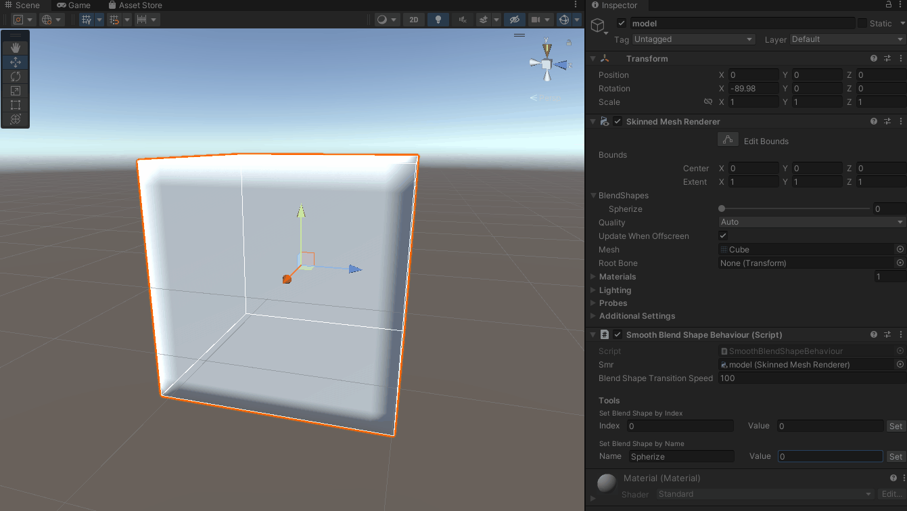

# SmoothBlendShapeExample
1. Add `SmoothBlendShapeBehaviour` to a game object with a `SkinnedMeshRenderer`
2. Assign the `SkinnedMeshRenderer` to the `SmoothBlendShapeBehaviour`'s `smr` field in the inspector
3. Call `SetBlendShapeWeight` with code or use the inspector tools to test the effect

#### Demo

#### Tips
- The effect may be too slow to notice, try increasing the `Blend Shape Transition Speed` field to 100 or more
- Ensure you're using the correct blend shape indices and names
